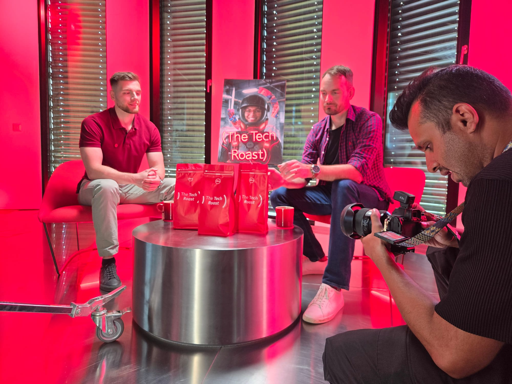
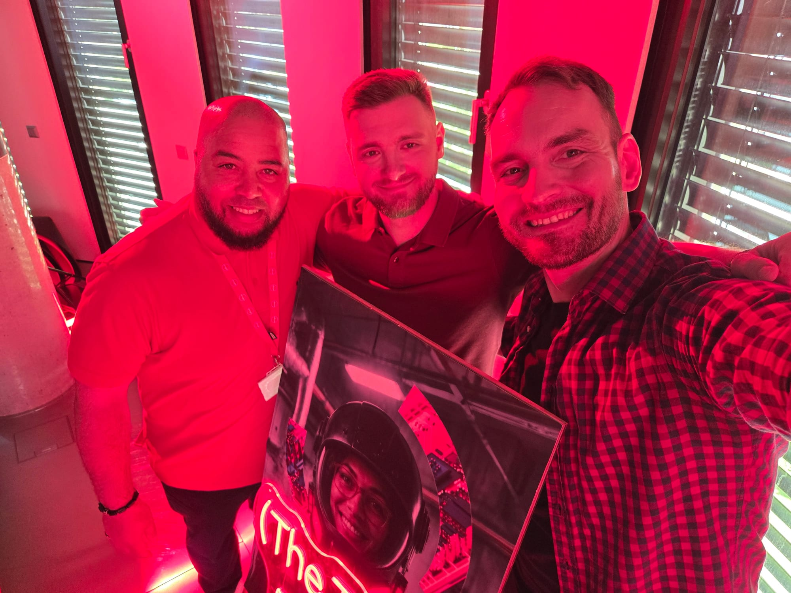

Today Laco Šulák and I recorded an episode of The Tech Roast, Absa's podcast.
It goes out some time later. We covered four things: where AI actually fits
into an engineering process, event-driven architecture on AWS, container
orchestration, and async patterns in service communication.

This is a short note written the same evening, on how we chose those four and
what the recording day looked like from the inside. It was my first time doing
one.

## Picking the topics

Our starting material was internal projects, which is a problem: internal work
is only interesting to an outside listener once you take the internals out of
it. Nobody can follow a tour of a system they cannot see. What survives the
translation is the shape of the problem and the reasoning that led to a
particular answer, so that is what we selected for — cases where the reasoning
generalizes past our own codebase.

We also decided not to script it. We agreed the areas, wrote down the positions
we each held, and noted where we knew we disagreed. Everything past that we
left to the conversation. A prepared answer is recognizable as one within a
sentence or two, and it closes off the more useful thing that happens when the
person across from you pushes back in real time.

## The four threads

**AI in the engineering process.** Not the demo version — the question of where
in a real delivery pipeline it earns its place, and where it quietly costs more
than it saves. Everyone has a position on this right now, which makes it harder
to say something useful rather than something agreeable.

**Event-driven architecture on AWS.** Why you reach for events, and what you
take on when you do. Teams that adopt events tend to meet the same second act:
the architecture is straightforward to draw and considerably harder to debug,
because the control flow that used to be a stack trace is now spread across
components and time.

**Container orchestration**, and how it changes the shape of the work rather
than only the deployment target.

**Async patterns in service communication**, which is the same conversation as
the previous two viewed from the point where services actually talk to each
other, and where ordering, retries and partial failure stop being theoretical.

We finished on where AI goes next. No idea yet whether those predictions hold
up.

## How the day ran

The production side was the part I had misjudged. I assumed a podcast meant two
people, two microphones and someone starting a recording. What it actually
involved was a small crew, a lit set, and more equipment than I expected — the
team took real care over lighting, framing and sound, and none of that work is
visible in the result, which is the point.

Make-up was new for both of us, and mildly difficult to take seriously while
holding an argument about distributed systems.

The practical effect is worth noting: once the setup is somebody else's
problem, the only thing left to think about is the person across from you. That
is a better position to be in than trying to remember your own notes.

## If you get asked

Prepare the shape of the conversation, not the wording.

The instinct is to write out good answers, because writing feels like
preparation. It is not — a rehearsed answer sounds rehearsed, and it removes
the room you need to respond to a real objection. What helps is knowing which
three or four positions you hold firmly enough to defend without notes, and
being honest about which ones you do not.

The episode lands at some point later. I have no doubt it will be a fun watch —
Laco made the conversation easy, which is most of the job.
